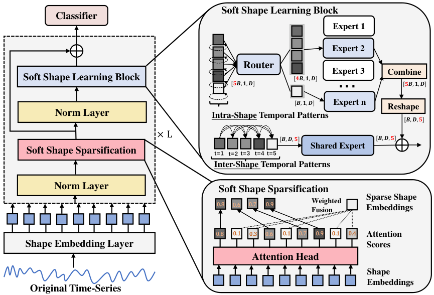

# Learning Soft Sparse Shapes for Efficient Time-Series Classification

This is the training code for our paper **Learning Soft Sparse Shapes for Efficient Time-Series Classification** (ICML-25, Spotlight).

## Abstract

Shapelets are discriminative subsequences (or shapes) with high interpretability in time series classification. Due to the time-intensive nature of shapelet discovery, 
existing shapelet-based methods mainly focus on selecting discriminative shapes while discarding others to achieve candidate subsequence sparsification.
However, this approach may exclude beneficial shapes and overlook the varying contributions of shapelets to classification performance.
To this end, we propose a **Soft** sparse **Shape**s (**SoftShape**) model for efficient time series classification. Our approach mainly introduces soft shape sparsification and soft shape learning blocks. 
The former transforms shapes into soft representations based on classification contribution scores, merging lower-scored ones into a single shape to retain and differentiate all subsequence information.
The latter facilitates intra- and inter-shape temporal pattern learning, improving model efficiency by using sparsified soft shapes as inputs. 
Specifically, we employ a learnable router to activate a subset of class-specific expert networks for intra-shape pattern learning. 
Meanwhile, a shared expert network learns inter-shape patterns by converting sparsified soft shapes into sequences. Extensive experiments demonstrate that SoftShape outperforms state-of-the-art methods and produces interpretable results. 
<p align="center">
    
</p>

## Datasets
We used 128 UCR time series datasets for time-series classification.
The datasets utilized in this study
can be downloaded at [128 UCR datasets.](https://www.cs.ucr.edu/~eamonn/time_series_data_2018/UCRArchive_2018.zip)

Please refer to **page 13** of the [PDF](https://www.cs.ucr.edu/~eamonn/time_series_data_2018/BriefingDocument2018.pdf) document for the password to access the zipped file of the UCR archive.

## Usage


To obtain a trained SoftShape model for time series classification, please run

```bash
python main_softshape.py --dataset [name of the UCR dataset you want to train]  ...
```
Note: Setting ```args.use_large_batch = 1``` can effective in increasing runtime speed without degrading SoftShape's overall average classification accuracy performance on the UCR 128 datasets.

For detailed options and examples, please refer to ```main_softshape.py```.

## Citation
If you use this code for your research, please cite our paper:
```
@inproceedings{liu2025softshape,
    title={Learning soft sparse shapes for efficient time-series classification},
    author={Zhen Liu and Yicheng Luo and Boyuan Li and Emadeldeen Eldele and Min Wu and Qianli Ma},
    booktitle={International Conference on Machine Learning},
    year={2025}
}
```